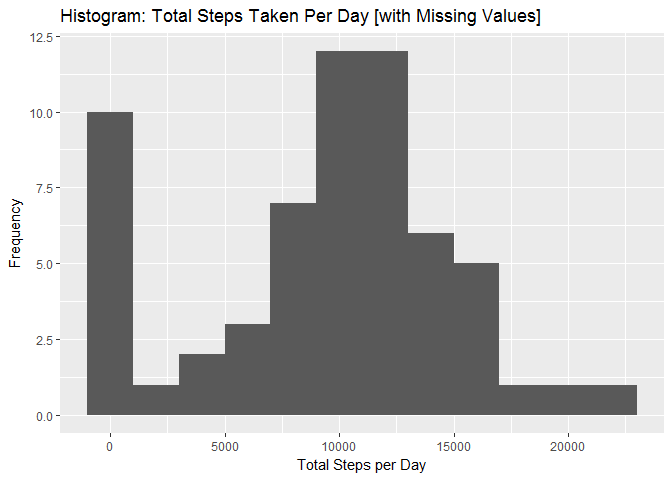
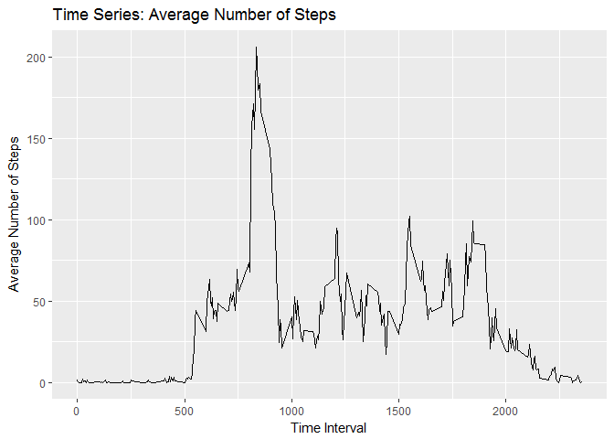
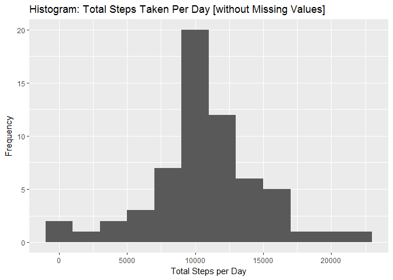
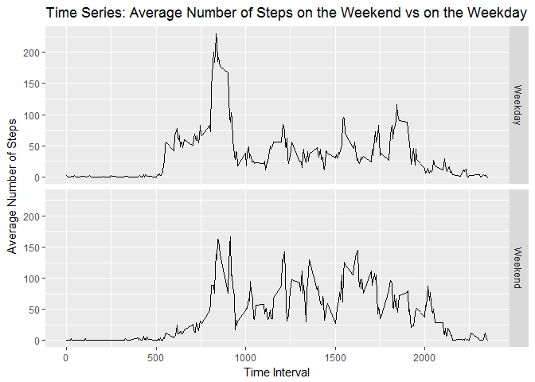

# Reproducible Research: Peer Assessment 1
Kelsey Messonnier  


#Loading and preprocessing the data

**1. Load the data from the .csv into R.**


```r
#Import data file and check the data types.

activity_data <- read.csv ("activity.csv",              #File to read
                            header = TRUE,              #Keep headers
                            sep = ",",                  #Delimiter is a comma
                            stringsAsFactors = FALSE)   #Treat strings as strings
str(activity_data)                                      #Check data types
```

```
## 'data.frame':	17568 obs. of  3 variables:
##  $ steps   : int  NA NA NA NA NA NA NA NA NA NA ...
##  $ date    : chr  "2012-10-01" "2012-10-01" "2012-10-01" "2012-10-01" ...
##  $ interval: int  0 5 10 15 20 25 30 35 40 45 ...
```
The "date" variable is read as a character value. This will need to be changed to a date. 


**2. Transform "date" from character value into date value.**


```r
#Transform data so that the date is in the proper date format.

activity_data$date <- as.Date(activity_data$date, "%Y-%m-%d")   #Reformat "date" from char to date
str(activity_data)                                              #Check that it worked
```

```
## 'data.frame':	17568 obs. of  3 variables:
##  $ steps   : int  NA NA NA NA NA NA NA NA NA NA ...
##  $ date    : Date, format: "2012-10-01" "2012-10-01" ...
##  $ interval: int  0 5 10 15 20 25 30 35 40 45 ...
```
Now the "date" variable is read as a date. 


#The mean total number of steps taken per day 

1. A Histogram of the total number of steps taken each day. 

```r
#Aggregates the number of steps, grouping by date.

daily_steps <- activity_data %>% 
               group_by(date) %>%                                 #Groups data by date
               summarize(steps_per_day = sum(steps, na.rm = T))   #Totals the number of steps per date


#Creates a histogram of the total steps taken per day with the appropiate bin sizes and chart titles.

ggplot(daily_steps, aes(x = steps_per_day)) + geom_histogram(binwidth = 2000) + ggtitle("Histogram: Total Steps Taken Per Day [with Missing Values]") + xlab("Total Steps per Day") + ylab("Frequency")                             
```

<!-- -->


**2. Calculate and report the mean and median total number of steps taken per day.**

```r
#Calculate and report the mean number of steps taken per day.

mean_steps <- round(mean(daily_steps$steps_per_day))             #Find and round the mean
report1 <- c("The mean total steps per day is", mean_steps)      #Create vector to output
cat(report1)                                                     #Print the mean so it's easily read
```

```
## The mean total steps per day is 9354
```

```r
#Calculate and report the median number of steps taken per day.

median_steps <- round(median(daily_steps$steps_per_day))         #Find and round the median
report2 <- c("The median total steps per day is", median_steps)  #Create vector to output
cat(report2)                                                     #Print the median so it's easily read
```

```
## The median total steps per day is 10395
```


#The average daily activity pattern

**1. A time series plot of the 5-minute interval and the average number of steps taken, averaged across all days.**

```r
#Aggregates the number of steps, grouping by 5-minute intervals.

interval_steps <- activity_data %>% 
                  group_by(interval) %>%
                  summarize(avg_steps = mean(steps, na.rm=TRUE))


#Creates a time series plot of the total steps taken by 5-minute intervals.

ggplot(interval_steps, aes(x = interval, y = avg_steps)) + geom_line() + ggtitle("Time Series: Average Number of Steps") + xlab("Time Interval") + ylab("Average Number of Steps")
```

<!-- -->


**2. The 5-minute interval with the maximum number of steps, on average across all the days in the data.**

```r
#Find the interval with the maximum number of steps.

round(interval_steps[which.max(interval_steps$avg_steps),])      #Outputs the interval and max steps
```

```
## # A tibble: 1 × 2
##   interval avg_steps
##      <dbl>     <dbl>
## 1      835       206
```


#Imputing missing values

**1. Calculate and report the total number of missing values in the dataset.**

```r
#Count and report the number of missing values in the data.

missing <- sum(is.na(activity_data$steps))
report <- c("The number of missing values in the data is", missing)  #Create vector to output
cat(report)                                                          #Print so it's easily read
```

```
## The number of missing values in the data is 2304
```


**2. Devise a strategy for filling in all of the missing values in the dataset.**

The strategy I will be using is to fill in the missing values with the mean the 5-minute time interval.

```r
#Check if there are any missing values in the interval mean data and print the number.

missing2 <- sum(is.na(mean(daily_steps$steps_per_day)))
report.2 <- c("The number of missing values in the 5-minute interval data is", missing2)  
cat(report.2)         
```

```
## The number of missing values in the 5-minute interval data is 0
```


**3. Create a new dataset that is equal to the original but with the missing data filled in.**

```r
#Create new dataset that has the missing values filled in.

activity_data2 <- activity_data                            #Assigns a new dataset name

for (i in 1:nrow(activity_data2)){                         #For each row in the new dataset
  if(is.na(activity_data2$steps[i])){                      #If steps is N/A
      index <- activity_data2$interval[i]                  #Set index to the interval
      value <- subset(interval_steps, interval==index)     #Set value to the interval_steps
      activity_data2$steps[i] <- value$avg_steps           #Change the value of N/A to that of
  }                                                             #average steps per interval
}
```


**4. Make a historgram of the total number of steps taken each day - calculate and report the mean and median.**

```r
#Same as above, but using the new dataset that has no missing values!

#Aggregates the number of steps, grouping by date.

new_daily_steps <- activity_data2 %>%                                  #Uses the new dataset
                   group_by(date) %>%                                  #Groups by date
                   summarize(steps_per_day2 = sum(steps, na.rm = T))   #Adds the number of steps per date


#Creates a histogram of the total steps taken per day, but the appropiate bin sizes and chart titles.

ggplot(new_daily_steps, aes(x = steps_per_day2)) + geom_histogram(binwidth = 2000) + ggtitle("Histogram: Total Steps Taken Per Day [without Missing Values]") + xlab("Total Steps per Day") + ylab("Frequency") 
```

<!-- -->

```r
#Calculate and report the mean number of steps taken per day.

mean_steps2 <- round(mean(new_daily_steps$steps_per_day2))           #Find and round the mean
report2.1 <- c("The mean total steps per day is", mean_steps2)       #Create vector to output
cat(report2.1)                                                       #Print the mean so it's easily read
```

```
## The mean total steps per day is 10766
```

```r
#Calculate and report the median number of steps taken per day.

median_steps2 <- round(median(new_daily_steps$steps_per_day2))       #Find and round the median
report2.2 <- c("The median total steps per day is", median_steps2)   #Create vector to output
cat(report2.2)                                                       #Print the median so it can be read
```

```
## The median total steps per day is 10766
```

The mean of dataset activity_data2, which contains no missing values, has mean of 10,766 and the activity_data, which does contain missing values, has mean of 9,354. The median of the dataset with no missing values is equal to its mean and is very close to the median of the dataset with missing values, which is 10,395. 

Imputing the missing data on the estimates of the total daily number of steps normalized the data.


#Differences in activity patterns between the weekdays and weekends

**1. Create a new factor variable in the dataset with 2 levels -- weekday and weekend.**

```r
#Create a new factor variable in the dataset for the weekend and the weekday.

activity_data2$day <- ifelse(weekdays(activity_data2$date)                   #Create new variable "day"
                      %in% c("Saturday", "Sunday"), "Weekend", "Weekday")    #If the weekday is a Sat
                                                                                #or Sun, label it weekend

activity_data2$day <- as.factor(activity_data2$day)         #Make "day" a factor
```

**2. Make a time series plot of the 5-minute interval and average number of steps taken.**

```r
#Subset the activity dataset into 2 different datasets.

weekend <- filter(activity_data2, day == "Weekend")         #Subset where "day" is a weekend
weekday <- filter(activity_data2, day == "Weekday")         #Subset where "day" is a weekday


#Calculate the average steps by 5-minute time interval for the weekend and the weekdays.

weekend <- weekend %>%                                            #Writes over weekend subset
           group_by(interval) %>%                                 #Group by the 5-minute intervals
           summarize(avg_steps = mean(steps))                     #Calc avg steps per interval
weekend$day <- "Weekend"                                          #Adds "day" back into the subset

weekday <- weekday %>%                                            #Writes over weekday subset
           group_by(interval) %>%                                 #Group by the 5-minute intervals
           summarize(avg_steps = mean(steps))                     #Calc avg steps per interval
weekday$day <- "Weekday"                                          #Adds "day" back into the subset


#Bind the weekend and weekday data together to make one dataset.

new_interval <- rbind(weekend, weekday)                           #Combines weekend and weekday subsets
new_interval$day <- as.factor(new_interval$day)                   #Makes "day" into a factor


#Creates a time series plot of the total steps taken on the weekend vs the weekdays by time intervals.

ggplot(new_interval, aes(interval, avg_steps)) + geom_line() + facet_grid(day~.) + ggtitle("Time Series: Average Number of Steps on the Weekend vs on the Weekday") + xlab("Time Interval") + ylab("Average Number of Steps")
```

<!-- -->

On the weekdays, the average number of steps is high in the morning, peaks around 5-minute interval 600, and then drops downs and levels out at a lower mean. On the weekends, the average number of steps taken throughout the day is much more consistent. It appears that on the weekends, activity starts later in the morning than on weekdays, but it lasts later into the day. 
